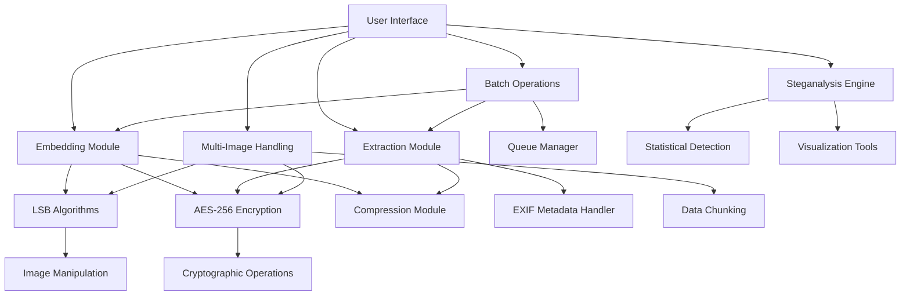

---

# 📷 SecurImage Pro — Advanced Steganography Suite

**SecurImage Pro** is a professional-grade steganography application enabling secure embedding of sensitive data within digital images using advanced cryptographic protocols and robust data-hiding algorithms. Designed for cybersecurity professionals, privacy advocates, and digital forensics experts, this suite combines **data encryption, multi-image support, steganalysis detection tools**, and **batch processing workflows** in a clean, modern user interface.

---

## 🌟 Key Features

### 🔒 Steganography Core

* **LSB Embedding/Extraction** supporting sequential, random, and interleaved bit patterns
* **Text and File Embedding** with optional compression support
* **AES-256-GCM Encryption** for embedded data
* **Password Protection** with strength meter and enforced security rules
* **EXIF Metadata Preservation** to retain original image authenticity

### 🚀 Advanced Capabilities

* **Multi-Image Steganography**: Split data across multiple images to increase capacity and stealth
* **Batch Processing**: Process multiple files (embed/extract) concurrently
* **Steganalysis Tools**: Detect hidden data via statistical analysis and visualization
* **Self-Destruct Mechanism**: Time-limited and view-limited access for embedded content
* **Dual-Layer Steganography**: Implement plausible deniability with decoy data layers
* **QR Recovery Code Generation**: Securely encode recovery metadata in QR codes

### 🖥️ Professional User Interface

* Modern, dark-themed graphical UI
* Drag-and-drop support for image selection
* Real-time data capacity indicators
* Tabbed workflows for embedding, extraction, batch operations, and analysis
* Progress tracking, detailed logs, and comprehensive error handling

---

## 📦 Installation

### ✅ Prerequisites

* Python **3.8+**
* `pip` package manager

### 📥 Setup Instructions

```bash
# Clone the project repository
git clone https://github.com/yuvarajthestrange/securimage-pro.git
cd securimage-pro

# Install dependencies
pip install -r requirements.txt

# Run the application
python steganography_app.py
```

### 📚 Python Dependencies

```
pillow>=9.0.0
numpy>=1.22.0
cryptography>=36.0.0
tkinterdnd2>=0.3.0
qrcode>=7.3.1
```

---

## 📖 Usage Guide

### 📌 Data Embedding

1. Select a **cover image**
2. Choose either **text input** or a **file** to embed
3. Set encryption password (optional, for AES-256)
4. Choose embedding pattern (Sequential, Random, Interleaved)
5. Enable compression if desired
6. Click **EMBED DATA** to create the stego-image

---

### 📌 Data Extraction

1. Select a **stego image**
2. Enter the decryption password if applicable
3. Click **EXTRACT DATA**
4. View or save the extracted data

---

### 📌 Multi-Image Embedding

1. Load multiple cover images
2. Choose the file to split and embed
3. Set encryption password and output directory
4. Click **EMBED ACROSS IMAGES**

---

### 📌 Batch Processing

1. Add multiple images or files
2. Select operation type (Embed/Extract)
3. Configure password and security preferences
4. Specify output directory
5. Click **START BATCH PROCESSING**

---

### 📌 Steganalysis

1. Load an image for analysis
2. Click **ANALYZE IMAGE**
3. Review detection results, statistical patterns, and LSB visualizations

---

## 🛠️ Technical Architecture



---

## 📸 Screenshots

| Embed Tab                                                        | Extract Tab                                                          | Multi-Image                                                                  | Steganalysis                                                                   |
| :--------------------------------------------------------------- | :------------------------------------------------------------------- | :--------------------------------------------------------------------------- | :----------------------------------------------------------------------------- |
|  |  |  |  |

---

## 🔐 Security Features

* **AES-256-GCM encryption** with PBKDF2 key derivation
* **Password strength enforcement** and real-time visual feedback
* **Secure in-memory handling**: zero sensitive data left in RAM after processing
* **Self-destruct mechanism** with expiration dates and maximum access limits
* **Plausible deniability via dual-layer steganography**
* **QR code recovery** for secure metadata retrieval

---

## 📊 Performance Benchmarks

| Operation                  | 1MB File     | 10MB File    |
| :------------------------- | :----------- | :----------- |
| **Embedding**              | 2.3s ± 0.4s  | 18.7s ± 2.1s |
| **Extraction**             | 1.8s ± 0.3s  | 15.2s ± 1.8s |
| **Multi-Image (5 images)** | 4.5s ± 0.7s  | 32.1s ± 3.2s |
| **Batch (10 files)**       | 12.8s ± 1.5s | 98.4s ± 8.7s |

> *Tests conducted on Intel i7-11800H @ 2.30GHz with 32GB RAM*

---

## 🤝 Contributing

We welcome contributions to **SecurImage Pro**.

### 📌 Contribution Guidelines

1. Fork the repository
2. Create a new feature branch

   ```bash
   git checkout -b feature/YourFeatureName
   ```
3. Commit your changes with clear messages
4. Push the branch

   ```bash
   git push origin feature/YourFeatureName
   ```
5. Open a Pull Request detailing your feature or fix

> Please follow **PEP 8 coding guidelines** and include clear docstrings and inline comments.

---

## 📜 License

**SecurImage Pro** is released under the **GNU General Public License v3.0**.
Refer to the [LICENSE](LICENSE) file for full licensing details.

---

## 🙏 Acknowledgements

* **Cryptography** for high-assurance encryption
* **Pillow** for advanced image processing
* **NumPy** for computational efficiency
* **TkinterDnD2** for enhanced drag-and-drop functionality
* **QR Code** for secure recovery code generation

---

## 📬 Support

For bug reports, feature requests, or support inquiries:

👉 [Open an Issue](https://github.com/yuvarajthestrange/securimage-pro/issues)

---

> **SecurImage Pro** © 2023 Security Solutions Inc. — *Modern Secure Steganography for the Digital World*

---

